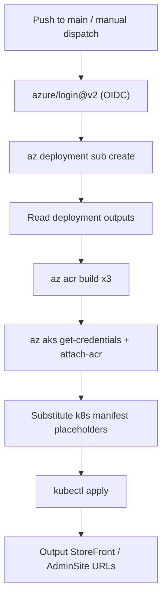

# Deploy AIforITOps on Azure via GitHub Actions (Bicep + OIDC)

This guide describes how to deploy the AI for IT/Ops sample application to Azure using GitHub Actions, Bicep Infrastructure as Code, and OpenID Connect (OIDC) federated credentials for passwordless authentication.

## Overview

The deployment pipeline:

1. Authenticates to Azure using OIDC (no client secrets stored in GitHub)
2. Provisions Azure infrastructure via [infra/main.bicep](infra/main.bicep)
3. Builds and pushes container images to Azure Container Registry (ACR)
4. Configures AKS and deploys Kubernetes manifests from [k8s/](k8s/)

The workflow is defined in [.github/workflows/deploy.yml](.github/workflows/deploy.yml) and mirrors the logic in the existing azd hooks ([infra/hooks/postprovision.sh](infra/hooks/postprovision.sh), [infra/hooks/postdeploy.sh](infra/hooks/postdeploy.sh)).



## Prerequisites

### Azure

- An active Azure subscription with sufficient quota for:
  - AKS (2 system + 2 user nodes, `Standard_D2s_v3`)
  - Azure Container Registry (Basic)
  - Cosmos DB
  - Service Bus
  - Key Vault
  - Azure OpenAI (`gpt-4o` in `westus` by default)
- Permissions to create app registrations and assign subscription-level roles (Owner or equivalent)

### GitHub

- This repository pushed to GitHub
- Permission to configure repository **Variables** (and optionally **Secrets**)
- `main` branch as the deployment trigger branch

### Local (optional, for troubleshooting)

- Azure CLI (`az`)
- Kubernetes CLI (`kubectl`)

## One-Time Azure OIDC Setup

Run these commands once to create the GitHub Actions identity and federated trust. Replace placeholders with your values.

```bash
# Variables - customize these
APP_NAME="github-aiforitops-deploy"
GITHUB_ORG="YOUR_GITHUB_ORG"          # e.g. microsoft
GITHUB_REPO="AIforITOps"
SUBSCRIPTION_ID="YOUR_SUBSCRIPTION_ID"

# 1. Create an Entra app registration
az ad app create --display-name "$APP_NAME"
APP_ID=$(az ad app list --display-name "$APP_NAME" --query "[0].appId" -o tsv)

# 2. Create a service principal
az ad sp create --id "$APP_ID"
SP_OBJECT_ID=$(az ad sp show --id "$APP_ID" --query id -o tsv)

# 3. Add federated credential for pushes to main
az ad app federated-credential create \
  --id "$APP_ID" \
  --parameters '{
    "name": "github-main",
    "issuer": "https://token.actions.githubusercontent.com",
    "subject": "repo:'"$GITHUB_ORG"'/'"$GITHUB_REPO"':ref:refs/heads/main",
    "description": "GitHub Actions - main branch",
    "audiences": ["api://AzureADTokenExchange"]
  }'

# 4. (Optional) Add federated credential for manual workflow_dispatch
az ad app federated-credential create \
  --id "$APP_ID" \
  --parameters '{
    "name": "github-manual",
    "issuer": "https://token.actions.githubusercontent.com",
    "subject": "repo:'"$GITHUB_ORG"'/'"$GITHUB_REPO"':environment:production",
    "description": "GitHub Actions - production environment",
    "audiences": ["api://AzureADTokenExchange"]
  }'

# 5. Assign subscription-level roles
az role assignment create \
  --assignee "$APP_ID" \
  --role "Contributor" \
  --scope "/subscriptions/$SUBSCRIPTION_ID"

az role assignment create \
  --assignee "$APP_ID" \
  --role "User Access Administrator" \
  --scope "/subscriptions/$SUBSCRIPTION_ID"
```

> **Note:** `User Access Administrator` is required because [infra/core/keyvault.bicep](infra/core/keyvault.bicep) creates Key Vault RBAC role assignments during deployment. Alternatively, assign `Owner` at subscription scope to cover both permissions.

### Capture these values for GitHub configuration

| Value | Source | GitHub setting name |
|-------|--------|---------------------|
| Application (client) ID | `$APP_ID` | `AZURE_CLIENT_ID` |
| Directory (tenant) ID | `az account show --query tenantId -o tsv` | `AZURE_TENANT_ID` |
| Subscription ID | `$SUBSCRIPTION_ID` | `AZURE_SUBSCRIPTION_ID` |
| Service principal object ID | `$SP_OBJECT_ID` | `AZURE_PRINCIPAL_ID` |

## GitHub Repository Configuration

Configure the following in **Settings > Secrets and variables > Actions**.

### Variables

| Name | Example | Description |
|------|---------|-------------|
| `AZURE_CLIENT_ID` | `xxxxxxxx-xxxx-xxxx-xxxx-xxxxxxxxxxxx` | Entra app client ID |
| `AZURE_TENANT_ID` | `xxxxxxxx-xxxx-xxxx-xxxx-xxxxxxxxxxxx` | Azure AD tenant ID |
| `AZURE_SUBSCRIPTION_ID` | `xxxxxxxx-xxxx-xxxx-xxxx-xxxxxxxxxxxx` | Target subscription |
| `AZURE_PRINCIPAL_ID` | `xxxxxxxx-xxxx-xxxx-xxxx-xxxxxxxxxxxx` | SP **object** ID (passed to Bicep `principalId`) |
| `AZURE_ENV_NAME` | `aiops-prod` | Environment name used in resource naming |
| `AZURE_LOCATION` | `eastus` | Primary Azure region for most resources |
| `AZURE_OPENAI_LOCATION` | `westus` | Region for Azure OpenAI (must have `gpt-4o` quota) |

> With OIDC, no client secret is required. All values above can be stored as **Variables** since none are sensitive credentials.

### Optional: GitHub Environment

If you created the `production` federated credential, add a GitHub Environment named `production` under **Settings > Environments** to enable approval gates before deployment.

## Workflow Behavior

The workflow [.github/workflows/deploy.yml](.github/workflows/deploy.yml) runs on:

- **Push** to the `main` branch
- **Manual dispatch** (`workflow_dispatch`) with optional `environmentName` and `location` inputs

### Step-by-step

| Phase | Action |
|-------|--------|
| **Authenticate** | `azure/login@v2` exchanges the GitHub OIDC token for an Azure access token |
| **Provision** | `az deployment sub create` deploys [infra/main.bicep](infra/main.bicep) at subscription scope |
| **Capture outputs** | Reads ACR, AKS, Key Vault, managed identity, and resource group names from deployment outputs |
| **Build images** | `az acr build` for `storefront`, `adminsite`, and `productworker` |
| **Configure AKS** | Attach ACR, assign managed identity to user node pool VMSS, label nodes `workload=true` |
| **Prepare manifests** | Substitute ACR login server, Key Vault name, tenant ID, and managed identity client ID into k8s templates |
| **Deploy** | `kubectl apply` for ConfigMaps, SecretProviderClasses, Deployments, and Services in `ai-demo` namespace |
| **Report** | Writes StoreFront and AdminSite external IPs to the GitHub Actions job summary |

### Infrastructure deployed

| Resource | Bicep module |
|----------|--------------|
| Resource Group | [infra/main.bicep](infra/main.bicep) |
| User-assigned Managed Identity | [infra/core/identity.bicep](infra/core/identity.bicep) |
| Azure Container Registry | [infra/core/acr.bicep](infra/core/acr.bicep) |
| Azure Kubernetes Service | [infra/core/aks.bicep](infra/core/aks.bicep) |
| Cosmos DB | [infra/core/cosmosdb.bicep](infra/core/cosmosdb.bicep) |
| Service Bus | [infra/core/servicebus.bicep](infra/core/servicebus.bicep) |
| Key Vault + secrets | [infra/core/keyvault.bicep](infra/core/keyvault.bicep), [infra/core/keyvault-secrets.bicep](infra/core/keyvault-secrets.bicep) |
| Azure OpenAI | [infra/core/openai.bicep](infra/core/openai.bicep) |

## Running a Deployment

### Automatic

Push a commit to `main`. The workflow starts automatically.

### Manual

1. Go to **Actions > Deploy to Azure**
2. Click **Run workflow**
3. Optionally override `environmentName` and `location`
4. Click **Run workflow**

## Verifying the Deployment

After the workflow completes, check the job summary for application URLs. You can also verify manually:

```bash
# Set context (replace with your values)
RESOURCE_GROUP="rg-aiops-prod"   # from workflow output
AKS_CLUSTER_NAME="aks-xxxxxxxx"  # from workflow output

az aks get-credentials --resource-group "$RESOURCE_GROUP" --name "$AKS_CLUSTER_NAME"

kubectl get pods -n ai-demo
kubectl get svc -n ai-demo
```

Expected services:

- `storefront` — LoadBalancer with external IP (customer-facing store)
- `adminsite` — LoadBalancer with external IP (admin portal)
- `productworker` — background worker (no external service)

## Troubleshooting

| Issue | Resolution |
|-------|------------|
| OIDC login fails (`AADSTS700213`) | Verify federated credential `subject` matches `repo:ORG/REPO:ref:refs/heads/main` exactly |
| Bicep deployment fails on role assignment | Ensure SP has `User Access Administrator` or `Owner` at subscription scope |
| OpenAI deployment fails | Confirm `gpt-4o` quota in `AZURE_OPENAI_LOCATION`; try a different region |
| Pods stuck in `Pending` | Check node labels: `kubectl get nodes --show-labels`; user pool nodes need `workload=true` |
| Pods fail to mount secrets | Verify managed identity is assigned to user pool VMSS and Key Vault RBAC is configured |
| External IP pending | AKS LoadBalancer provisioning can take several minutes; re-run `kubectl get svc -n ai-demo` |

## Relationship to azd

The existing [azure.yaml](azure.yaml) and `azd up` workflow remain available for local development. The GitHub Actions pipeline is an independent, CI/CD-oriented path that uses the same Bicep templates and Kubernetes manifests without requiring Azure Developer CLI in the pipeline.

## Security Notes

- OIDC eliminates long-lived Azure client secrets in GitHub
- Federated credentials should be scoped to specific branches/environments
- Key Vault uses RBAC; the CI service principal receives Secrets Officer only during provisioning
- AKS workload identity and Key Vault CSI driver handle runtime secret access for pods
